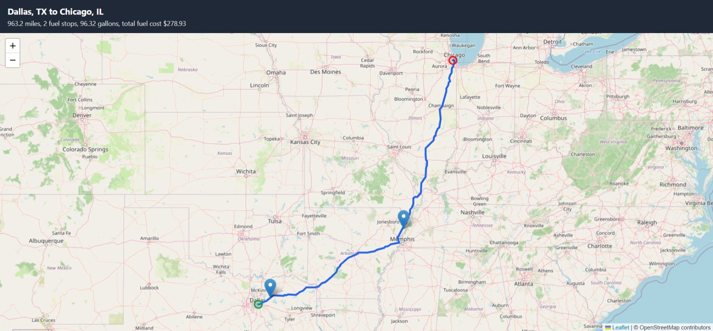

# Fuel Route Planner API

A Django REST API that plans a truck trip between two US cities and picks the most cost effective fuel stops along the way.

You send a start and a finish city. The API returns:

- the route as a GeoJSON line you can draw on any map
- the fuel stops, with how many gallons to buy at each one
- the total fuel cost for the trip
- a link to a map page that shows the route and the stops

Rules from the assignment:

- the truck has a maximum range of **500 miles** (a 50 gallon tank)
- the truck gets **10 miles per gallon**
- fuel prices come from the provided CSV file
- the outside routing API is called **once per request** (and zero times for a repeat trip, thanks to caching)



---

## How to run it yourself

### 1. What you need

- Python 3.12 or newer
- Docker Desktop (to run PostgreSQL)
- A free OpenRouteService API key from [openrouteservice.org](https://openrouteservice.org/) (sign up, open the Dashboard, and create a free Standard key)

### 2. Get the code and install packages

```bash
git clone https://github.com//huzaifazahoor/fuel-route-planner-api.git
cd fuel-route-planner-api

python -m venv venv
# Windows PowerShell
venv\Scripts\Activate.ps1
# macOS / Linux
source venv/bin/activate

pip install -r requirements.txt
```

### 3. Create your `.env` file

Copy the example file and fill in your own values:

```bash
cp .env.example .env
```

```env
DJANGO_SECRET_KEY=change-me-to-a-long-random-string
DJANGO_DEBUG=True

DB_NAME=fuel_db
DB_USER=fuel_user
DB_PASSWORD=fuel_pass
DB_HOST=localhost
DB_PORT=5432

ORS_API_KEY=your-openrouteservice-key
```

Docker Compose and Django both read this same file, so there is only one place to change settings.

### 4. Start the database and create the tables

```bash
docker compose up -d
python manage.py migrate
```

### 5. Load the fuel stations

```bash
python manage.py load_stations
```

You should see:

```
Saved 6626 stations.
Skipped rows (Canada or bad data): 620
Stations with no city match (no lat/long): 435
```

You can run this command again at any time. It clears the table and loads it fresh, so the result is always the same.

### 6. Start the server

```bash
python manage.py runserver
```

---

## How to use the API

### Endpoint

`POST /api/route/`

### Request body

| Field | Required | Example | Notes |
|---|---|---|---|
| `start` | yes | `"Dallas, TX"` | Must be `City, ST` |
| `finish` | yes | `"Chicago, IL"` | Must be `City, ST` |
| `start_fuel_gallons` | no | `0` | Fuel already in the tank, from 0 to 50. Default is 0 |

### Example with curl

```bash
curl -X POST http://127.0.0.1:8000/api/route/ \
  -H "Content-Type: application/json" \
  -d '{"start": "Dallas, TX", "finish": "Chicago, IL"}'
```

### Example with PowerShell

```powershell
$r = Invoke-RestMethod -Method Post -Uri "http://127.0.0.1:8000/api/route/" `
  -ContentType "application/json" `
  -Body '{"start": "Dallas, TX", "finish": "Chicago, IL"}'

$r | Select-Object total_miles, total_gallons_bought, total_fuel_cost
$r.stops | Format-Table city, state, mile_marker, price_per_gallon, gallons, cost
Start-Process $r.map_url
```

### Example response (route coordinates shortened)

```json
{
  "start": { "name": "Dallas, TX", "lat": 32.7935, "lng": -96.7667 },
  "finish": { "name": "Chicago, IL", "lat": 41.8375, "lng": -87.6866 },
  "duration_hours": 21.6,
  "total_miles": 963.2,
  "total_gallons_bought": 96.32,
  "total_fuel_cost": 278.93,
  "fuel_before_first_stop": null,
  "stops": [
    {
      "station_id": 68213,
      "name": "CADOO MILLS",
      "city": "Caddo Mills",
      "state": "TX",
      "mile_marker": 37.7,
      "off_route_miles": 2.5,
      "price_per_gallon": 2.801,
      "gallons": 50.0,
      "cost": 140.03
    },
    {
      "station_id": 64617,
      "name": "SHELL",
      "city": "Osceola",
      "state": "AR",
      "mile_marker": 482.3,
      "off_route_miles": 2.9,
      "price_per_gallon": 2.999,
      "gallons": 46.32,
      "cost": 138.9
    }
  ],
  "route": { "type": "LineString", "coordinates": [[-96.7667, 32.7935], "..."] },
  "map_url": "http://127.0.0.1:8000/api/route/map/?start=Dallas%2C+TX&finish=Chicago%2C+IL&start_fuel_gallons=0"
}
```

A quick way to check the answer: `total_gallons_bought` is always `total_miles / 10`.

### Map page

`GET /api/route/map/?start=Dallas, TX&finish=Chicago, IL`

Opens a page with the route line, the start (green), the finish (red), and a pin for each fuel stop. Click a pin to see the price, gallons, and cost. The API response already includes this link as `map_url`. The map page uses the cached route, so it does not call the routing API again.

### Errors

| Status | When |
|---|---|
| `400` | Bad input, like `"Dallas"` without a state, or a city that is not in the US cities list |
| `422` | No valid plan exists, like a gap of more than 500 miles with no fuel station |
| `502` | The routing API failed or could not be reached |

---

## How it works

```
Request ("Dallas, TX" -> "Chicago, IL")
   |
   |  1. Look up both cities in data/uscities.csv        (no API call)
   |  2. Get the truck route from OpenRouteService         (1 API call, cached for a day)
   |  3. Keep one route point about every half mile
   |  4. Find stations near the route using the grid       (in memory)
   |  5. Pick the fuel stops with the greedy planner
   v
Response (route + stops + total cost + map link)
```

### Main parts

| File | What it does |
|---|---|
| `apps/fuel/models.py` | `FuelStation` table: CSV fields plus latitude and longitude |
| `apps/fuel/management/commands/load_stations.py` | One-time loader: reads the CSV, drops Canadian rows, keeps the cheapest price per station, adds coordinates |
| `apps/fuel/services/locations.py` | Turns `"City, ST"` into latitude and longitude using the offline cities file |
| `apps/fuel/services/routing.py` | The single call to OpenRouteService, with caching |
| `apps/fuel/services/stations.py` | In-memory grid of stations and the haversine distance function |
| `apps/fuel/services/fuel_planner.py` | The fuel stop logic |
| `apps/fuel/services/planner.py` | Ties everything together for one trip |
| `apps/fuel/views.py` | The API endpoint and the map page |

### Finding stations near the route

Checking every route point against every station would be slow. Instead, stations are grouped into a grid of 0.5 degree cells (roughly 25 to 35 miles wide) when the first request comes in. For each part of the route, the code only looks at the cell it is in and the 8 cells around it. Then it uses the haversine formula to get the real distance and keeps stations within 10 miles of the road.

The grid is built once and kept in memory with `functools.lru_cache`. It is loaded lazily on the first request instead of at startup, so commands like `migrate` never touch it.

### Choosing the fuel stops

Each station near the route gets a mile marker (how far along the trip it is). Then the planner walks the route using a greedy rule:

1. At a station, if a station that is **at least 10 cents per gallon cheaper** is within reach, buy only enough fuel to get there.
2. If nothing cheaper is within reach, **fill the tank**, then drive to the cheapest station that is at least 200 miles ahead. If there is none that far, go to the farthest station in reach.
3. Near the finish, buy only what is needed to arrive, so no money is spent on leftover fuel.

The 10 cent and 200 mile rules exist because a pure "cheapest price" plan made many tiny stops (like 1 gallon, then another station 18 miles later). On a Los Angeles to New York trip, these rules cut the plan from 15 stops to 10 and also lowered the total cost.

---

## Assumptions and choices

- **Only US stations are used.** The CSV has 620 rows from Canadian provinces (AB, BC, MB, NB, NS, ON, QC, SK, YT). They are skipped because the task is USA only.
- **Duplicate station IDs keep the cheapest price.** The CSV has 8,151 rows but only 6,738 unique station IDs.
- **Station coordinates are city centers.** The CSV has no coordinates, only city and state, so each station gets the coordinates of its city. This is why a station can be up to 10 miles from the road and still count.
- **435 stations have no coordinates.** Their town is not in the free cities file, so they are left out of planning. That still leaves 6,191 stations, which covers the US well.
- **The truck starts empty by default** and fills up near the start, so the total cost covers fuel for the whole trip. Stations within 50 miles of the start count as "at the start." You can pass `start_fuel_gallons` if the truck already has fuel.
- **If there is no station near the start**, the truck is assumed to have just enough fuel to reach the first station, and that fuel is still charged at the first station's price. It shows up in `fuel_before_first_stop`, so the total cost is never hidden or too low. This happens on Los Angeles trips, where the data has no station until Henderson, NV.
- **The route uses the `driving-hgv` profile** (heavy goods vehicle) from OpenRouteService, since this is for trucks.
- **Detour miles to reach a station are not added to the fuel cost.** They are small because stations must be within 10 miles of the road.

---

## Performance

Measured on a laptop, Los Angeles, CA to New York, NY (about 2,790 miles):

| Request | Time |
|---|---|
| First request for a new trip (includes the OpenRouteService call) | about 2.1 seconds |
| Same trip again (route comes from cache) | about 120 ms |

Things that keep it fast:

- **1 routing API call per new trip, 0 for a repeat trip.** Start and finish cities are found in a local file, not with a geocoding API.
- **Routes are cached for a day** with Django's built-in cache.
- **The route is thinned** to about one point every half mile before planning and before sending the response.
- **The station grid lives in memory**, so no database queries happen during planning.

No Redis or PostGIS is needed. The data is small (a few thousand stations), so plain Python and memory are faster and simpler to set up.

---

## Testing the planner without an API key

```bash
python manage.py try_planner --start "Dallas, TX" --finish "Chicago, IL"
```

This uses a fake straight-line route instead of calling OpenRouteService, so you can check the fuel logic offline. Straight-line miles are shorter than real road miles.

---

## Data sources and credits

- **Fuel prices:** `fuel-prices-for-be-assessment.csv`, provided with the assessment.
- **US city coordinates:** `data/uscities.csv` comes from the free Basic version of the [SimpleMaps US Cities Database](https://simplemaps.com/data/us-cities). The fuel price CSV only has city and state, so this file is used to give each station (and each start and finish city) a latitude and longitude, with no API calls. The Basic version is free to use with credit to SimpleMaps.
- **Routing:** [OpenRouteService](https://openrouteservice.org/) directions API, truck profile.
- **Map:** [Leaflet](https://leafletjs.com/) with map tiles from [OpenStreetMap](https://www.openstreetmap.org/copyright) contributors.

---

## What I would add with more time

- Geocode the 435 unmatched towns once with a free geocoder and save the results to a file, so every station can be used.
- Add the detour distance to reach a station into the cost.
- Add a small cost for each stop (time is money for truckers) and solve it with dynamic programming instead of a greedy rule.
- Add unit tests for the planner with fixed fake stations.
- Accept any address, not just `City, ST`.